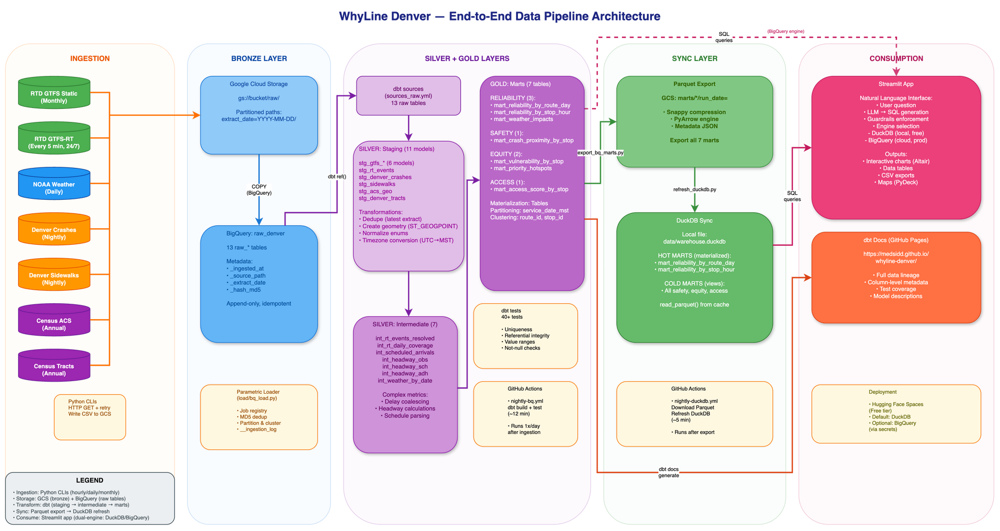
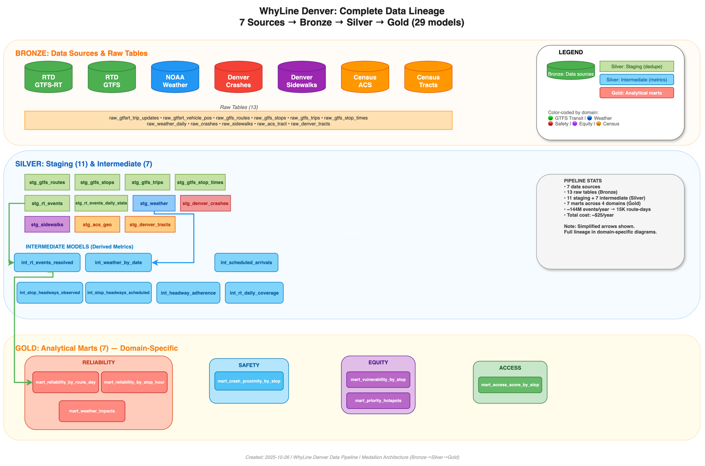

# WhyLine Denver


**A dual-engine transit analytics platform for Denver's RTD system**. WhyLine Denver ingests GTFS schedules, real-time feeds, Denver crash and sidewalk data, NOAA weather, and Census demographics—then models them with **dbt** to publish curated analytical datasets in **BigQuery** and **DuckDB**. A guardrailed **LLM-to-SQL** interface lets anyone query these datasets using natural language, revealing **where reliability is weakest**, especially for transit-dependent neighborhoods, and where **safety and accessibility** investments could have the most impact.

## What Makes This Project Unique

Most transit analytics tools give you dashboards. WhyLine Denver gives you a **governed data platform** where:

- **Natural language becomes SQL** – Ask "Which routes run late during snowstorms?" and get back validated SQL, visualizations, and downloadable CSVs.
- **Costs are capped** – BigQuery queries are limited by `MAX_BYTES_BILLED`; you see dry-run costs before execution.
- **Data quality is enforced** – dbt tests validate every model; GitHub Actions run nightly to keep everything fresh.
- **Dual-engine flexibility** – Use DuckDB locally for free exploration or switch to BigQuery for production-scale analysis.
- **Equity-focused** – Purpose-built metrics identify where vulnerable populations face the worst service.

## Quickstart (DuckDB, local)

```bash
# 1. Set up Python environment
python -m venv .venv && source .venv/bin/activate
pip install -r requirements.txt

# 2. Copy environment template and configure credentials
cp .env.example .env
# Edit .env to add your GCP project, bucket, and optional API keys

# 3. Sync latest data from BigQuery exports to local DuckDB
make sync-duckdb

# 4. Launch the Streamlit app
make app
# Opens at http://localhost:8501
```

That's it. You now have a local analytical database with 7 marts covering reliability, safety, equity, and accessibility—refreshed nightly by automated workflows.

## Production Path (BigQuery)

For production workloads or larger teams:

1. **Authenticate with GCP:**
   ```bash
   gcloud auth application-default login
   ```

2. **Configure `.env`:**
   Set `GCP_PROJECT_ID`, `BQ_DATASET_RAW`, `BQ_DATASET_STG`, `BQ_DATASET_MART`, and `GCS_BUCKET`.

3. **Switch engine in app sidebar:**
   Select **BigQuery** as the query engine. Queries will show dry-run byte estimates and respect `MAX_BYTES_BILLED` limits.

4. **Deploy to Hugging Face Spaces** (optional):
   See [.github/workflows/README.md](.github/workflows/README.md) for deployment instructions.

## Data Architecture: Bronze → Silver → Gold

WhyLine Denver follows a **medallion architecture** to progressively refine raw data into trusted analytical datasets:

```
┌─── BRONZE LAYER ────────────────────────────────────────────┐
│  Raw ingestion: Python CLIs fetch data from public APIs     │
│  • GTFS Static (monthly): routes, stops, schedules          │
│  • GTFS Realtime (hourly, 15x/day): trip delays, positions  │
│  • Weather (daily): NOAA temperature, precipitation, snow   │
│  • Crashes (nightly): Denver 5-year traffic accident data   │
│  • Sidewalks (nightly): pedestrian infrastructure segments  │
│  • Census ACS (annual): demographics by tract               │
│  • Tract Boundaries (annual): geographic polygons           │
│                                                             │
│  Storage: GCS (raw/*/extract_date=YYYY-MM-DD/)              │
│  Loader: Parametric BigQuery loader with idempotency        │
│  Output: 13 raw_* tables in BigQuery                        │
└─────────────────────────────────────────────────────────────┘
                            ↓
┌─── SILVER LAYER ────────────────────────────────────────────┐
│  Staging & Intermediate: dbt models clean and enrich        │
│  • Deduplication (latest extract wins)                      │
│  • Geometry creation (POINT/LINE for spatial joins)         │
│  • Timezone normalization (UTC → MST)                       │
│  • Complex metrics (headway adherence, delay resolution)    │
│                                                             │
│  Staging Models (11): stg_gtfs_*, stg_rt_events, stg_...    │
│  Intermediate Models (7): int_*_resolved, int_headway_*     │
│  Storage: BigQuery views (stg_denver dataset)               │
└─────────────────────────────────────────────────────────────┘
                            ↓
┌─── GOLD LAYER ──────────────────────────────────────────────┐
│  Marts: Final analytical tables for consumption             │
│                                                             │
│  RELIABILITY DOMAIN                                         │
│  • mart_reliability_by_route_day: on-time %, delays by      │
│    route + weather conditions (incremental, 30-day window)  │
│  • mart_reliability_by_stop_hour: hourly stop performance   │
│  • mart_weather_impacts: how precipitation degrades OTP     │
│                                                             │
│  SAFETY DOMAIN                                              │
│  • mart_crash_proximity_by_stop: crashes within 100m/250m   │
│    of each transit stop (spatial join, last 365 days)       │
│                                                             │
│  EQUITY DOMAIN                                              │
│  • mart_vulnerability_by_stop: composite score (0-100)      │
│    measuring % households without cars, % using transit,    │ 
│    and % in poverty within 0.5mi walkable catchment         │
│  • mart_priority_hotspots: stops where vulnerability,       │
│    low reliability, and crash exposure intersect            │
│                                                             │
│  ACCESS DOMAIN                                              │
│  • mart_access_score_by_stop: sidewalk density within       │
│    200m buffer (pedestrian infrastructure quality)          │
│                                                             │
│  Storage: BigQuery tables (mart_denver dataset)             │
│  Export: Parquet files in GCS → synced to local DuckDB      │
└─────────────────────────────────────────────────────────────┘
```

### Pipeline Architecture Diagram



**[View full diagram](docs/diagrams/pipeline.drawio)** | **[Edit in draw.io](https://app.diagrams.net)**

The pipeline architecture diagram shows the complete end-to-end data flow across 5 layers:
- **Ingestion**: 7 data sources (GTFS, GTFS-RT, weather, crashes, sidewalks, Census)
- **Bronze**: GCS raw storage + BigQuery raw tables (13 tables)
- **Silver + Gold**: dbt transformations (11 staging, 7 intermediate, 7 marts)
- **Sync**: Parquet export + DuckDB materialization
- **Consumption**: Streamlit app + dbt docs

## Data Lineage

WhyLine Denver tracks complete lineage from source APIs through transformations to final marts. Every raw table includes metadata columns (`_ingested_at`, `_source_path`, `_extract_date`, `_hash_md5`) for traceability. dbt's built-in lineage graph shows dependencies between 29 models across staging, intermediate, and mart layers.

**Key Lineage Paths:**

1. **Reliability Analysis:**
   ```
   GTFS-RT APIs → raw_gtfsrt_trip_updates + raw_gtfsrt_vehicle_positions
   → stg_rt_events (join + dedupe)
   → int_rt_events_resolved (delay coalescing)
   → mart_reliability_by_route_day (aggregate + weather join)
   → mart_weather_impacts (delta from baseline)
   ```

2. **Equity Analysis:**
   ```
   Census API → raw_acs_tract → stg_acs_geo
   TIGERweb API → raw_denver_tracts → stg_denver_tracts
   GTFS → raw_gtfs_stops → stg_gtfs_stops
   → mart_vulnerability_by_stop (spatial join, population-weighted averages)
   ```

3. **Safety Analysis:**
   ```
   Denver Open Data → raw_crashes → stg_denver_crashes
   GTFS → raw_gtfs_stops → stg_gtfs_stops
   → mart_crash_proximity_by_stop (ST_DISTANCE within 250m, last 365 days)
   ```

### Comprehensive Data Lineage Diagram



**[View full diagram](docs/diagrams/data_lineage_comprehensive.drawio)** | **[Edit in draw.io](https://app.diagrams.net)**

This diagram visualizes all 29 models across the medallion architecture:
- **Bronze**: 7 sources → 13 raw tables
- **Silver**: 11 staging models + 7 intermediate models
- **Gold**: 7 analytical marts (Reliability, Safety, Equity, Access domains)

For domain-specific lineage diagrams and additional architecture documentation, see [docs/ARCHITECTURE.md](docs/ARCHITECTURE.md).

## Freshness & Automation

All pipelines run on GitHub Actions:

- **Hourly (5am-7pm MST, 15x/day):** GTFS Realtime snapshots capture trip delays and vehicle positions. Each hour takes 3 snapshots, 2 minutes apart, to smooth over API jitter.
- **Nightly (8am UTC / 1-2am MST):** Static data refreshes (GTFS schedules, crashes, sidewalks, weather, demographics).
- **Nightly (9am UTC / 2-3am MST):** dbt runs all staging → intermediate → marts, validates data quality with 40+ tests, then exports marts to GCS as Parquet.
- **Nightly (9:30am UTC):** DuckDB sync downloads Parquet exports and materializes hot marts locally.

The app displays freshness timestamps:
- "Built from mart_denver as of 2025-10-24 02:15 UTC"
- "DuckDB last synced: 2025-10-24 02:45 UTC"

If data is stale (>24 hours), the app shows a warning banner.

## Data Sources & Licenses

WhyLine Denver uses only public, non-PII data:

| Source | Data | License | Attribution |
|--------|------|---------|-------------|
| **RTD (Regional Transportation District)** | GTFS Static, GTFS Realtime | [Open Data License](https://www.rtd-denver.com/open-data-license) | © 2025 Regional Transportation District |
| **Denver Open Data** | Traffic crashes, sidewalk segments | [Open Database License](https://www.denvergov.org/opendata/terms) | © 2025 City and County of Denver |
| **NOAA/NCEI** | Daily weather summaries (USC00053005) | Public domain | National Oceanic and Atmospheric Administration |
| **U.S. Census Bureau** | ACS 5-year estimates, TIGER/Line boundaries | Public domain | U.S. Census Bureau, 2023 ACS |

All attributions appear in the app footer and are linked in data model documentation.

## FAQ

### Why DuckDB?

DuckDB is a fast, embeddable analytical database that runs locally without servers. For WhyLine Denver, it means:
- **Free exploration**: No BigQuery costs during development
- **Offline capable**: Query marts without network access
- **CI-friendly**: Tests run against materialized DuckDB in GitHub Actions
- **Great demo UX**: Stakeholders can download a single `warehouse.duckdb` file and run queries immediately

### Why guardrails?

WhyLine Denver's LLM-to-SQL feature is powerful, but we enforce strict boundaries:
- **SELECT-only**: No INSERT, UPDATE, DELETE, DROP, or DDL
- **Allow-list**: Only pre-approved marts are queryable (no raw tables)
- **Cost caps**: BigQuery queries fail if they exceed `MAX_BYTES_BILLED` (default: 2GB)
- **Dry-run preview**: Users see estimated bytes scanned before execution

This prevents runaway costs, accidental data corruption, and drift from the curated semantic layer.

### Privacy & PII?

WhyLine Denver ingests zero personally identifiable information. All datasets are aggregated or anonymized:
- GTFS and GTFS-RT contain only trip/route/stop IDs (no passenger data)
- Crash data has lat/lon but no names or license plates
- Census ACS is aggregated to census tract level (typically 4,000 people)
- Weather is from a single airport station

### How fresh is the data?

- **GTFS Static**: Updated monthly when RTD publishes new schedules
- **GTFS Realtime**: 2-minute lag from API publish to BigQuery (hourly snapshots during service hours)
- **Weather**: 3-7 day lag (NOAA finalization period)
- **Crashes**: 24-hour lag (nightly ingest of Denver Open Data)
- **Demographics**: Annual (ACS 5-year estimates)

The QA script ([docs/QA_Validation_Guide.md](docs/QA_Validation_Guide.md)) validates freshness and alerts if data falls behind SLAs.

### Can I use this for my city?

Yes! WhyLine Denver is designed to be extensible. To adapt it:

1. Replace RTD's GTFS URLs with your city's transit agency feeds
2. Update crash/sidewalk ingestors to point to your city's open data portal
3. Change NOAA station ID to your local weather station
4. Adjust Census geography filters to your county/metro area
5. Redeploy dbt models (most will work as-is if GTFS semantics are standard)

See [docs/ARCHITECTURE.md](docs/ARCHITECTURE.md) for detailed adaptation guidelines.

### What's the tech stack?

| Layer | Technology | Why? |
|-------|------------|------|
| **Ingestion** | Python 3.11, Click CLIs | Flexible HTTP fetching, CSV writing, GCS uploads |
| **Orchestration** | GitHub Actions (cron workflows) | Free, declarative, version-controlled pipelines |
| **Storage (raw)** | Google Cloud Storage | Cheap object storage, partition-friendly paths |
| **Warehouse** | BigQuery | Serverless, scales to TB, native geospatial support |
| **Transformation** | dbt 1.8, Jinja, SQL | Standard data modeling framework, lineage graphs |
| **Local Analytics** | DuckDB | Fast, embeddable, Parquet-native, free |
| **App** | Streamlit 1.37, Pandas, PyDeck | Rapid prototyping, interactive widgets, map layers |
| **LLM Integration** | Gemini (Google Generative AI) | SQL generation from natural language prompts |
| **Testing** | pytest, dbt tests | Unit + integration tests, data quality contracts |
| **Code Quality** | Ruff, Black, pre-commit | Fast linting, consistent formatting |

### What's the annual cost?

Running WhyLine Denver costs approximately **$25/year**:

- GTFS-RT storage (16GB): $0.55
- BigQuery storage (25GB): $0.50
- BigQuery compute (365 dbt runs): ~$7
- GCS Parquet exports (2GB): $0.05
- GitHub Actions (6 workflows, 5,500+ runs/year): $0 (within free tier)
- Streamlit on Hugging Face Spaces: $0 (free tier)

BigQuery has a 1TB/month free tier; WhyLine Denver scans ~100GB/month, well within limits for small teams.

## Team Conventions

If you're contributing:

- **Imports**: Group as `stdlib` → blank line → `third-party` → blank line → `local`. Ruff enforces this.
- **Type hints**: All functions must have complete annotations. We treat MyPy warnings as errors.
- **Logging**: Use `src/whylinedenver/logs.py` helpers for structured JSON logs. Set `WLD_LOG_LEVEL=DEBUG` when diagnosing.
- **Commits**: Follow [Conventional Commits](https://www.conventionalcommits.org/): `feat:`, `fix:`, `chore:`, `docs:`, etc.
- **PRs**: Include a checklist: tests passed, lint clean, no secrets committed, screenshots for UI changes.

## Additional Resources

- **[dbt Models Documentation](dbt/models/README.md)** – Detailed breakdown of all 29 models (staging, intermediate, marts), materialization strategies, and testing approach.
- **[Model Lineage & Docs](https://medsidd.github.io/whyline-denver/)** – Interactive dbt documentation with full data lineage graphs, column-level descriptions, and test coverage (auto-deployed via GitHub Pages).
- **[GitHub Workflows Documentation](.github/workflows/README.md)** – How the 6 automated workflows orchestrate ingestion, transformation, and sync.
- **[Pipeline Architecture](docs/ARCHITECTURE.md)** – Deep dive into data flow, medallion layers, and system design decisions.
- **[QA Validation Guide](docs/QA_Validation_Guide.md)** – How to run health checks, interpret results, and troubleshoot issues.
- **[Data Contracts](docs/contracts/CONTRACTS.md)** – Schema specifications for all CSV outputs; breaking change policy.

---

**Questions?** Open an issue or check the workflow logs in GitHub Actions. For architectural decisions, see [docs/ARCHITECTURE.md](docs/ARCHITECTURE.md). For data quality validation, run `./scripts/qa_script.sh`.
